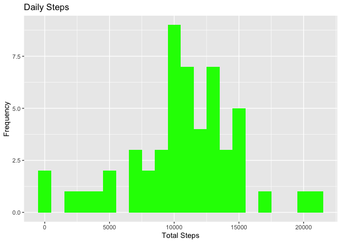
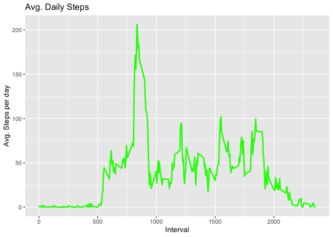
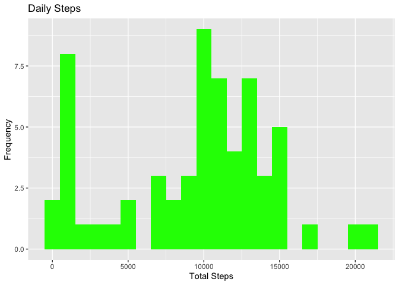
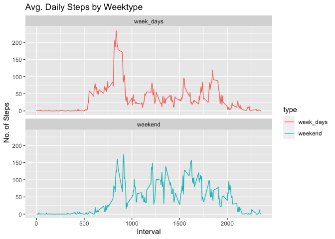

## Introductio

It is now possible to collect a large amount of data about personal movement using activity monitoring devices such as a Fitbit, Nike Fuelband, or Jawbone Up. These type of devices are part of the “quantified self” movement – a group of enthusiasts who take measurements about themselves regularly to improve their health, to find patterns in their behavior, or because they are tech geeks. But these data remain under-utilized both because the raw data are hard to obtain and there is a lack of statistical methods and software for processing and interpreting the data.

## 1. Assignment Statement

This assignment makes use of data from a personal activity monitoring device. This device collects data at 5 minute intervals through out the day. The data consists of two months of data from an anonymous individual collected during the months of October and November, 2012 and include the number of steps taken in 5 minute intervals each day.

The data for this assignment can be downloaded from the course web site:

Dataset: [Activity monitoring data](https://d396qusza40orc.cloudfront.net/repdata%2Fdata%2Factivity.zip) 

The variables included in this dataset are:

- steps: Number of steps taking in a 5-minute interval (missing values are coded as \color{red}{\verb|NA|}NA)
- date: The date on which the measurement was taken in YYYY-MM-DD format
- interval: Identifier for the 5-minute interval in which measurement was taken
The dataset is stored in a comma-separated-value (CSV) file and there are a total of 17,568 observations in this dataset.

This assignment will be described in multiple parts. You will need to write a report that answers the questions detailed below. Ultimately, you will need to complete the entire assignment in a single R markdown document that can be processed by knitr and be transformed into an HTML file.

Throughout your report make sure you always include the code that you used to generate the output you present. When writing code chunks in the R markdown document, always use \color{red}{\verb|echo = TRUE|}echo=TRUE so that someone else will be able to read the code. This assignment will be evaluated via peer assessment so it is essential that your peer evaluators be able to review the code for your analysis.


## Loading and preprocessing the data

```r
library("data.table")
library(dplyr)
```

```
## 
## Attaching package: 'dplyr'
```

```
## The following objects are masked from 'package:data.table':
## 
##     between, first, last
```

```
## The following objects are masked from 'package:stats':
## 
##     filter, lag
```

```
## The following objects are masked from 'package:base':
## 
##     intersect, setdiff, setequal, union
```

```r
library(ggplot2)

act <- read.csv("/Users/amin_mac_pro/RepData_PeerAssessment1/activity.csv")
```


```r
colnames(act)
```

```
## [1] "steps"    "date"     "interval"
```
## What is mean total number of steps taken per day?


```r
totalSteps <- act %>%
  group_by(date) %>% 
  summarise(total_steps = sum(steps))

head(totalSteps, 10)
```

```
## # A tibble: 10 x 2
##    date       total_steps
##    <fct>            <int>
##  1 2012-10-01          NA
##  2 2012-10-02         126
##  3 2012-10-03       11352
##  4 2012-10-04       12116
##  5 2012-10-05       13294
##  6 2012-10-06       15420
##  7 2012-10-07       11015
##  8 2012-10-08          NA
##  9 2012-10-09       12811
## 10 2012-10-10        9900
```


```r
ggplot(totalSteps, aes(x = total_steps)) +
    geom_histogram(fill = "green", binwidth = 1000) +
    labs(title = "Daily Steps", x = "Total Steps", y = "Frequency")
```

```
## Warning: Removed 8 rows containing non-finite values (stat_bin).
```

<!-- -->


```r
Mean_Median <- totalSteps %>% 
  summarise(mean_steps = mean(total_steps,na.rm = TRUE),median_steps = median(total_steps, na.rm = TRUE))


head(Mean_Median)
```

```
## # A tibble: 1 x 2
##   mean_steps median_steps
##        <dbl>        <int>
## 1     10766.        10765
```


## What is the average daily activity pattern?


```r
intervalSteps <- act %>%
  group_by(interval) %>% 
  summarise(interval_steps = mean(steps,na.rm = TRUE))

head(intervalSteps, 10)
```

```
## # A tibble: 10 x 2
##    interval interval_steps
##       <int>          <dbl>
##  1        0         1.72  
##  2        5         0.340 
##  3       10         0.132 
##  4       15         0.151 
##  5       20         0.0755
##  6       25         2.09  
##  7       30         0.528 
##  8       35         0.868 
##  9       40         0     
## 10       45         1.47
```

```r
ggplot(intervalSteps, aes(x = interval , y = interval_steps)) + 
  geom_line(color="green", size=1) + 
  labs(title = "Avg. Daily Steps", x = "Interval", y = "Avg. Steps per day")
```

<!-- -->


```r
max_interval <- intervalSteps %>%
  filter( interval_steps == max(interval_steps,na.rm = TRUE))

head(max_interval)
```

```
## # A tibble: 1 x 2
##   interval interval_steps
##      <int>          <dbl>
## 1      835           206.
```
## Imputing missing values


```r
totalNA <- act %>%
  summarise(total_NA = sum(is.na(steps)))

head(totalNA, 10)
```

```
##   total_NA
## 1     2304
```

```r
act_1 <- act %>% 
  group_by(interval) %>% 
  mutate(steps = replace(steps, is.na(steps), median(steps, na.rm=TRUE)))
  #summarise(interval_steps = mean(steps,na.rm = TRUE))
head(act_1) 
```

```
## # A tibble: 6 x 3
## # Groups:   interval [6]
##   steps date       interval
##   <int> <fct>         <int>
## 1     0 2012-10-01        0
## 2     0 2012-10-01        5
## 3     0 2012-10-01       10
## 4     0 2012-10-01       15
## 5     0 2012-10-01       20
## 6     0 2012-10-01       25
```

```r
data.table::fwrite(x = act_1, file = "/Users/amin_mac_pro/RepData_PeerAssessment1/tidyactivity.csv", quote = FALSE)
```

```r
totalSteps <- act_1 %>%
  group_by(date) %>% 
  summarise(total_steps = sum(steps))

head(totalSteps, 10)
```

```
## # A tibble: 10 x 2
##    date       total_steps
##    <fct>            <int>
##  1 2012-10-01        1141
##  2 2012-10-02         126
##  3 2012-10-03       11352
##  4 2012-10-04       12116
##  5 2012-10-05       13294
##  6 2012-10-06       15420
##  7 2012-10-07       11015
##  8 2012-10-08        1141
##  9 2012-10-09       12811
## 10 2012-10-10        9900
```


```r
ggplot(totalSteps, aes(x = total_steps)) +
    geom_histogram(fill = "green", binwidth = 1000) +
    labs(title = "Daily Steps", x = "Total Steps", y = "Frequency")
```

<!-- -->

```r
Mean_Median <- totalSteps %>% 
  summarise(mean_steps = mean(total_steps,na.rm = TRUE),median_steps = median(total_steps, na.rm = TRUE))


head(Mean_Median)
```

```
## # A tibble: 1 x 2
##   mean_steps median_steps
##        <dbl>        <int>
## 1      9504.        10395
```

Yes they are different.

## Are there differences in activity patterns between weekdays and weekends?

```r
act_2 <- act %>% 
  mutate(date = as.POSIXct(date, format = "%Y-%m-%d"))


act_2 <- act_2 %>% 
  mutate(day_week = weekdays(x = date))


act_2 <- act_2 %>%
  mutate(type = if_else(grepl(pattern = "Monday|Tuesday|Wednesday|Thursday|Friday", x = day_week),'week_days','weekend'))


head(act_2)
```

```
##   steps       date interval day_week      type
## 1    NA 2012-10-01        0   Monday week_days
## 2    NA 2012-10-01        5   Monday week_days
## 3    NA 2012-10-01       10   Monday week_days
## 4    NA 2012-10-01       15   Monday week_days
## 5    NA 2012-10-01       20   Monday week_days
## 6    NA 2012-10-01       25   Monday week_days
```


```r
interval_Steps_weekdays <- act_2 %>%
  group_by(interval,type) %>% 
  summarise(interval_steps = mean(steps,na.rm = TRUE))

head(interval_Steps_weekdays, 10)
```

```
## # A tibble: 10 x 3
## # Groups:   interval [5]
##    interval type      interval_steps
##       <int> <chr>              <dbl>
##  1        0 week_days          2.33 
##  2        0 weekend            0    
##  3        5 week_days          0.462
##  4        5 weekend            0    
##  5       10 week_days          0.179
##  6       10 weekend            0    
##  7       15 week_days          0.205
##  8       15 weekend            0    
##  9       20 week_days          0.103
## 10       20 weekend            0
```

```r
ggplot(interval_Steps_weekdays , aes(x = interval , y = interval_steps, color=`type`)) + geom_line() + labs(title = "Avg. Daily Steps by Weektype", x = "Interval", y = "No. of Steps") + facet_wrap(~`type` , ncol = 1, nrow=2)
```

<!-- -->


